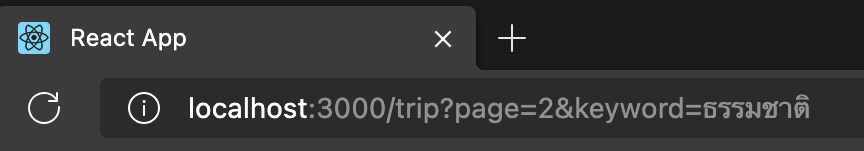
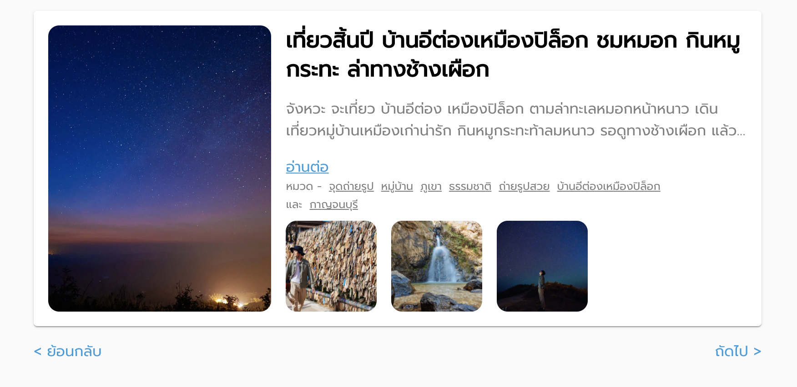
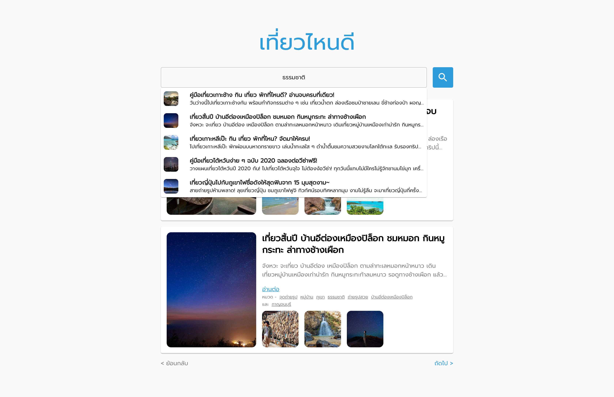
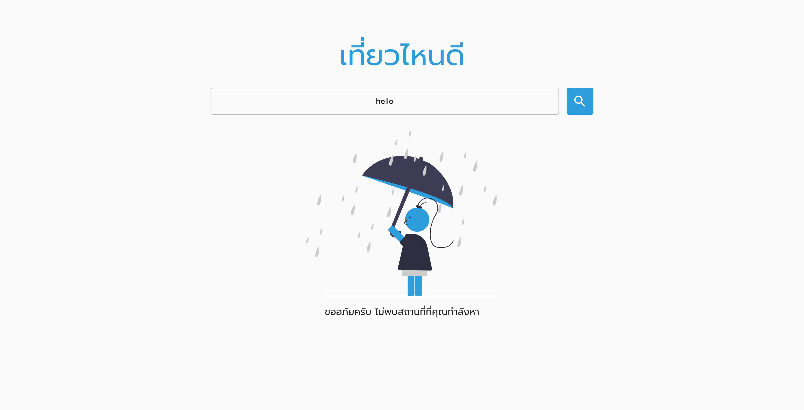
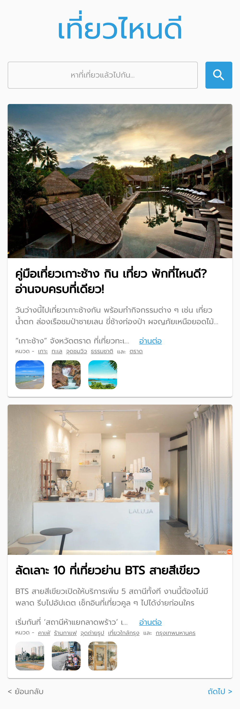
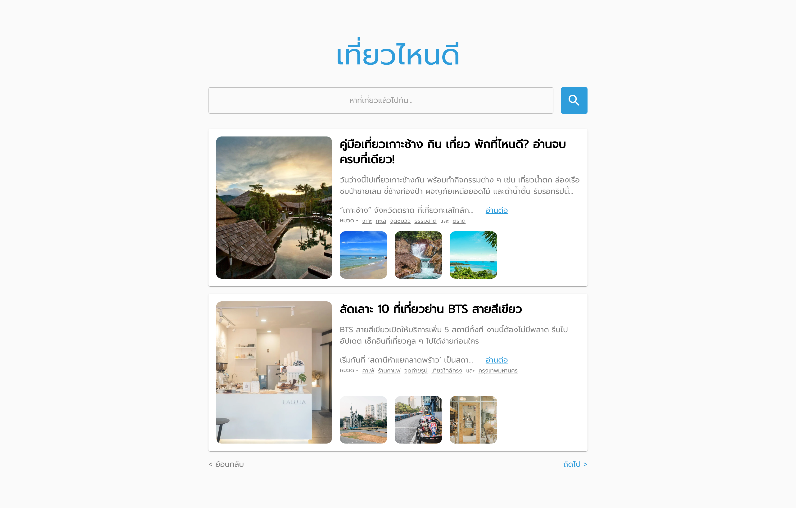

## React Web Application

How to run react web application

```
cd web
yarn start
```

### Completed Tasks

- [x] เมื่อกดชื่อทริป จะต้อง link ไปยัง url ที่ได้จาก trip data
- [x] เมื่อกดอ่านต่อ จะต้อง link ไปยัง url ที่ได้จาก trip data
- [x] หมวดหมู่ที่แสดง สามารถกดและกลายเป็น search keyword โดยเป็นชื่อ tag นั้น
- [x] จะต้องมีการแสดงผลรูปที่ได้รับมา เพื่อดึงดูดให้ user กดเข้าไปที่ตัวทริป

- [x] User สามารถ copy link และส่งต่อไปให้เพื่อน สำหรับ keyword เดียวกัน (Optional)

- [x] The website will not fetch all the data per page, user can click pagination to see more trips

- [x] Suggestion availables trip when user is searching

- [x] Display not found UI when the user's keyword does not match any trip in db

- [x] Seperate responsive UI whether the page is in small or big screen
##### Small Screen

##### Big Screen
